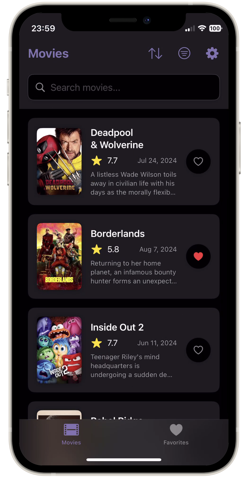
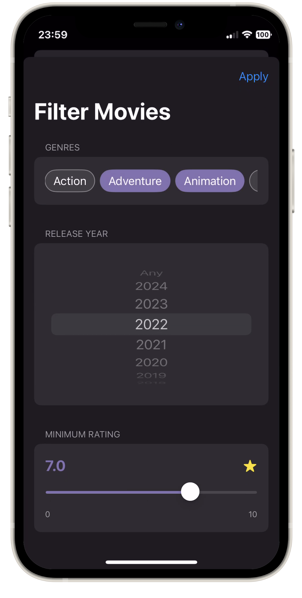
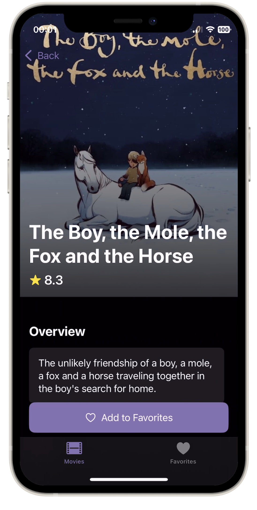
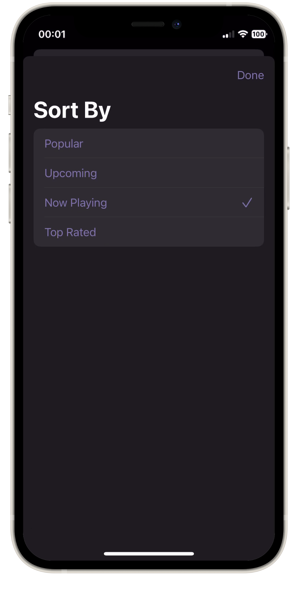

# Modern Movie App (iOS)

## Overview

This iOS app interacts with The Movie Database (TMDB) API. Every line of code has been generated
or suggested by AI using a large language model.

## Current state

The codebase is currently under development, with core features implemented and more being added.

<table>
  <tr>
    <td></td>
    <td></td>
  </tr>
  <tr>
    <td></td>
    <td></td>
  </tr>
</table>

## Setup

1. Get a TMDB API key from [themoviedb.org](https://www.themoviedb.org/).
2. Create a `Secrets.plist` file in the project root with the following content:
   ```xml
   <?xml version="1.0" encoding="UTF-8"?>
   <!DOCTYPE plist PUBLIC "-//Apple//DTD PLIST 1.0//EN" "http://www.apple.com/DTDs/PropertyList-1.0.dtd">
   <plist version="1.0">
   <dict>
       <key>API_KEY</key>
       <string>your_api_key_here</string>
   </dict>
   </plist>
   ```
3. Open the project in Xcode and build.

## Tech Stack

- **Language**: Swift
- **UI Framework**: SwiftUI
- **Architecture**: MVVM (Model-View-ViewModel)
- **Networking**: URLSession
- **JSON Parsing**: Codable
- **Image Loading**: AsyncImage
- **Asynchronous Programming**: Swift Concurrency
- **State Management**: @Published, @State, @Binding
- **Dependency Injection**: Manual (via init and @EnvironmentObject)
- **UI Components**: SwiftUI native components
- **Build System**: Xcode
- **Minimum iOS Version**: iOS 17.4 (as per current project settings)

## Key Features

1. Browse movies by different categories (popular, upcoming, now playing, top-rated)
2. Search for movies
3. View detailed movie information
4. Mark movies as favorites
5. Apply filters (genre, release year, minimum rating)
6. Toggle between light and dark themes
7. Localization support

## Architecture

The app follows the MVVM (Model-View-ViewModel) architecture:

- Model: Represented by the `Movie` and `MovieResponse` structs
- View: SwiftUI views in various view files
- ViewModel: `NetworkManager` manages the app's state and business logic

## Data Flow

1. The `NetworkManager` fetches data from the TMDB API
2. Data is then exposed to the UI components via @Published properties
3. UI components observe these properties and update when the data changes

## Networking

The app uses `URLSession` for network requests. The `NetworkManager` class handles all API calls and data parsing.

## State Management

The app uses SwiftUI's state management tools:
- @Published for observable object properties
- @State for view-local state
- @Binding for passing mutable state to child views
- @EnvironmentObject for dependency injection

## Theming

The app supports dynamic theming with light and dark mode options. The `ThemeManager` class handles theme selection and application.

## Localization

The app supports localization with strings defined in `Localizable.strings`.

## Third-Party Libraries

- Atlantis: Used for network debugging